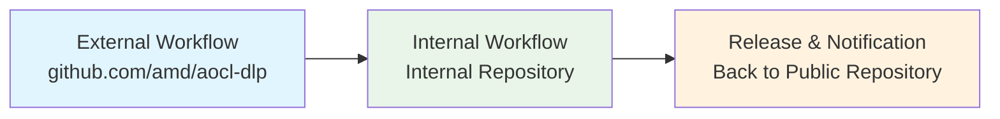
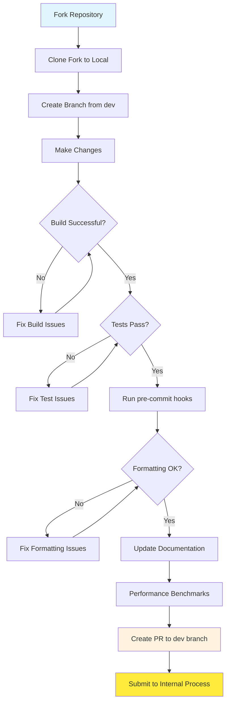
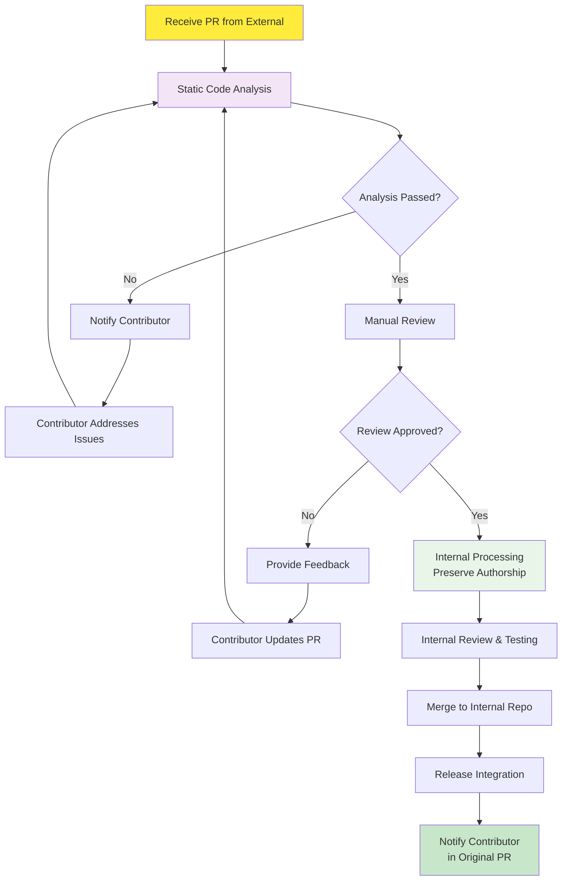

## How to contribute to AOCL-DLP

First, we want to thank you for your interest in contributing to AOCL-DLP! Please read through the following guidelines to help you better understand how to best contribute your potential bug report, bugfix, feature, etc.

#### **Did you find a bug?**

* **Check if the bug has already been reported** by searching on GitHub under [Issues](https://github.com/amd/aocl-dlp/issues).

* If you can't find an open issue addressing the problem, please feel free to [open a new one](https://github.com/amd/aocl-dlp/issues/new). Some things to keep in mind as you create your issue:
   * Be sure to include a **meaningful title**. Aim for a title that is neither overly general nor overly specific.
   * Putting some time into writing a **clear description** will help us understand your bug and how you found it.
   * You are welcome to include the AOCL-DLP version number if you wish, but please supplement it with the **actual git commit number** corresponding to the code that exhibits your reported behavior (the first seven or eight hex digits is fine).
   * Unless you are confident that it's not relevant, it's usually recommended that you **tell us how you configured AOCL-DLP** and **about your environment in general**. Your hardware microarchitecture, OS, compiler (including version), CMake options, build configuration are all good examples of things you may wish to include. If the bug involves elements of the build system such as CMake, bash, or python functionality, please include those version numbers, too.
   * If your bug involves behavior observed after linking to AOCL-DLP and running an application, please provide a minimally illustrative **code sample** that developers can run to (hopefully) reproduce the error or other concerning behavior.

#### **Did you write a patch that fixes a bug?**

If so, great, and thanks for your efforts! Please follow the pull request workflow outlined in the [Pull Request Workflow](#pull-request-workflow) section below.

* Ensure the PR description clearly describes the problem and solution. Include any relevant issue numbers, if applicable.

* Please limit your PR to addressing one issue at a time. For example, if you are fixing a bug and in the process you find a second, unrelated bug, please open a separate PR for the second bug (or, if the bugfix to the second bug is not obvious, you can simply open an [issue](https://github.com/amd/aocl-dlp/issues/new) for the second bug).

* Before submitting new code, please ensure your code follows the project's formatting conventions. The project uses clang-format with pre-commit hooks for automatic code formatting. See the [Code Quality Guidelines](#code-quality-guidelines) section below for setup instructions.

#### **Do you have concerns about code formatting?**

Code formatting is handled automatically by clang-format through pre-commit hooks. The project maintains consistent formatting standards without requiring manual intervention.

If you notice formatting inconsistencies or believe the current clang-format configuration could be improved, please feel free to [open an issue](https://github.com/amd/aocl-dlp/issues/new) to discuss potential changes to the `.clang-format` configuration file. We welcome suggestions for improving code formatting standards that benefit the entire project.

#### **Do you intend to add a new feature or change an existing one?**

That's fine, we are interested to hear your ideas!

* You may wish to introduce your idea by opening an [issue](https://github.com/amd/aocl-dlp/issues/new) to describe your new feature, or how an existing feature is not sufficiently general-purpose. This allows you the chance to open a dialogue with other developers, who may provide you with useful feedback.

* Before submitting new code, please ensure your code follows the project's formatting conventions and includes appropriate tests for the new functionality.

#### **Do you have questions about the source code?**

* Feel free to ask questions by opening an [issue](https://github.com/amd/aocl-dlp/issues/new) on GitHub. Use the "question" label to help categorize your inquiry. We encourage community discussion and are happy to help you understand the codebase.

## Pull Request Workflow

### Getting Started

1. **Fork the Repository**: Fork the [aocl-dlp repository](https://github.com/amd/aocl-dlp) to your GitHub account.

2. **Clone Your Fork**: Clone your forked repository to your local machine.
   ```bash
   git clone https://github.com/your-username/aocl-dlp.git
   cd aocl-dlp
   ```

3. **Create a Branch**: Create a new branch from the `dev` branch for your changes.
   ```bash
   git checkout dev
   git checkout -b your-feature-branch
   ```

### Submission Process

1. **Submit Pull Request**: Create a pull request from your fork to the `dev` branch of [https://github.com/amd/aocl-dlp](https://github.com/amd/aocl-dlp).

2. **Static Code Analysis**: Your pull request will undergo automated static code analysis to ensure code quality and adherence to project standards.

3. **Manual Review**: Once static analysis passes, the pull request will be reviewed manually by project maintainers for technical correctness, design considerations, and overall fit with the project.

4. **Internal Processing**: After successful review and automated testing in the public repository, your contribution will be integrated into the internal development repository for further testing and validation.

5. **Internal Review and Merge**: The code undergoes additional internal reviews and testing before being merged into the internal repository.

6. **Release Integration**: Your changes will be included in future releases according to the project's standard release cycle. You will be notified in the original pull request when your contribution has been successfully integrated.

**Important Notes:**
- All pull requests must target the `dev` branch
- The public repository serves as the entry point for community contributions
- Changes go through both public and internal review processes to ensure quality and security
- **Commit authorship is preserved**: Your original commit authorship and details will be maintained throughout the internal processing and integration phases
- Release timing follows established project schedules

## Development Workflow

### Building AOCL-DLP

Before contributing, you'll need to build the project from source. Comprehensive build instructions are available in [BUILD.md](BUILD.md), which covers:

* System requirements (CMake ≥ 3.26, C11/C++17 support, etc.)
* Build configuration options
* Quick start instructions for Linux
* Advanced configuration for threading models, sanitizers, and optimization options
* Troubleshooting common build issues

### Testing Your Changes

AOCL-DLP uses a comprehensive testing framework based on Google Test with YAML configuration. For complete testing instructions, see the [DLP-Testing wiki](https://github.com/amd/aocl-dlp/wiki/DLP-Testing).

**Quick testing workflow:**
```bash
# Build with tests enabled
cmake -DBUILD_TESTING=ON -DDLP_CTEST_DISABLED=OFF ..
make -j$(nproc)

# Run all tests
ctest --output-on-failure
```

### Benchmarking Performance

AOCL-DLP includes a modern benchmarking framework using Google Benchmark with YAML configuration. For comprehensive benchmarking instructions, see the [DLP-Benching wiki](https://github.com/amd/aocl-dlp/wiki/DLP-Benching).

**Quick benchmarking workflow:**
```bash
# Build with benchmarks enabled
cmake -DBUILD_BENCHMARKS=ON ..
make -j$(nproc)

# Run benchmarks
./bench/bench_gemm
```

### Code Quality Guidelines

* **Setup Development Environment**: Run `./scripts/setup.sh` to configure pre-commit hooks that automatically format code and run quality checks
* **Manual Formatting**: To manually trigger formatting and all pre-commit hooks, run `pre-commit run --all`
* **Code Style**: The project uses clang-format for automatic code formatting - pre-commit hooks will handle this automatically
* **Documentation**: Update relevant documentation for any new features or API changes
* **Testing**: Include appropriate tests for new functionality and ensure existing tests pass
* **Performance**: Consider performance implications and include benchmarks for performance-critical changes

### Pull Request Checklist

The pull request workflow is divided into external (contributor-controlled) and internal (maintainer-controlled) processes. The following diagrams illustrate each phase:

#### Overall Process Flow



#### External Workflow (Contributor Process)



#### Internal Workflow (Maintainer Process)



Before submitting a pull request, please ensure:

- [ ] Repository is forked to your GitHub account
- [ ] Pull request targets the `dev` branch
- [ ] Code builds successfully with the default configuration
- [ ] All existing tests pass (`ctest --output-on-failure`)
- [ ] New functionality includes appropriate tests
- [ ] Code follows the project's formatting conventions (run `pre-commit run --all`)
- [ ] Documentation is updated if needed
- [ ] Performance implications are considered and benchmarked if applicable
- [ ] PR description clearly explains the changes and references any related issues

Here at the AOCL-DLP project, we :heart: our community. :) Thanks for helping to make AOCL-DLP better!

AOCL-DLP Team
